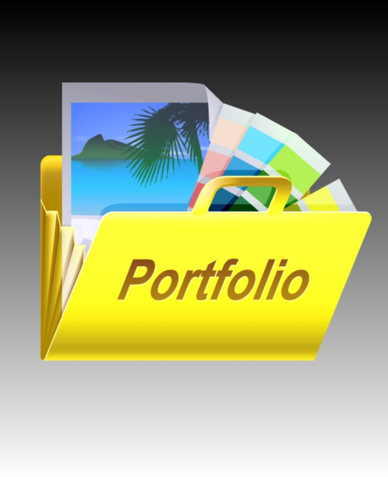

# 💼 Personal Portfolio Website - Madan Lal

Welcome to my personal portfolio! I'm Madan Lal, a passionate **Frontend Developer** with experience in building responsive, user-friendly websites using **HTML**, **CSS**, **JavaScript**, and **React**.

## 🔗 Live Website
👉 [View Portfolio](https://madanlal-codes.github.io/)

## 📸 Preview

---

## 🚀 Features

- 🧑‍💻 Responsive Web Design
- 🎨 Clean & Modern UI/UX
- 🛠️ Built with HTML5, CSS3, JavaScript
- 📱 Mobile-First Design
- 🧰 Integrated contact form using Google Apps Script
- 🔗 Social Media Links & CV Download
- ⚙️ Typing animation using Typed.js
- 📁 Project showcase including an Amazon Clone

---

## 🛠️ Technologies Used

- **HTML5**
- **CSS3**
- **JavaScript (ES6+)**
- **React.js**
- **Bootstrap 5**
- **Git & GitHub**
- **Google Apps Script**
- **Figma** (for UI prototyping)

---

## 📂 Projects Highlighted

| Project                | Description                                                                                     | Link                                                                 |
|------------------------|-------------------------------------------------------------------------------------------------|----------------------------------------------------------------------|
| **Amazon UI Clone**    | Fully responsive e-commerce clone with cart & product features.                                | [Live Site](https://madanlal-codes.github.io/Amazon-clone/)         |
| **Portfolio Website**  | This current portfolio showcasing my work, skills, and contact form.                           | [Live Site](https://madanlal-codes.github.io/)                      |
| **Upcoming Projects**  | Exploring new technologies and improving frontend skills with real-world challenges.           | [GitHub](https://github.com/madanlal-codes)                         |

---

## 📞 Contact

- 📧 Email: madanlal.codes@gmail.com  
- 📱 Phone: +91 7982831936  
- 🌐 [LinkedIn](https://www.linkedin.com/in/madanlal-codes/)  
- 📄 [Download My CV](./images/Madan_Lal%20-%20CV.pdf)

---

## 📜 License

This project is open source and available under the [MIT License](LICENSE).

---

### 🙌 Thank you for visiting my portfolio!
